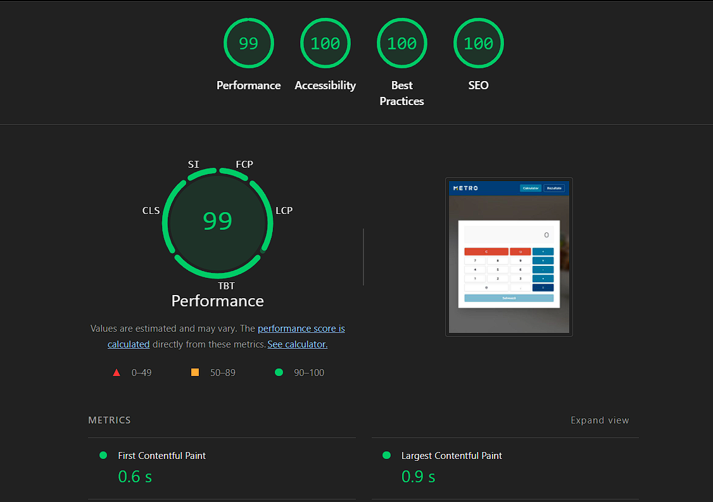

# Metro Calc – Demo Calculator App

## Descriere
`metro-calc` este o aplicație demo React + TypeScript care consumă librăria `metro-ui`. Aplicația oferă un calculator cu suport pentru salvarea rezultatelor și vizualizarea istorică a acestora.  

Funcționalități:
- Calculator cu operații (+, -, *, /)
- Save modal pentru eticheta unui calcul
- Clear modal pentru confirmarea resetării
- Results page cu istoric cronologic al calculelor

---

## Instalare

```
git clone https://github.com/DanaLazar/metro-calc.git
cd metro-calc
npm install
npm run dev
```

## Decizii arhitecturale
- Separare clară UI vs business logic prin hook-uri (useCalculatorController, useResultsController)
- Redux Toolkit pentru state management scalabil
- Metro UI ca librărie de componente reutilizabile
- Tipare TypeScript stricte pentru toate slice-urile și hook-urile
- Testabilitate prin Vitest + RTL
- Responsive design cu TailwindCSS

## Performance

